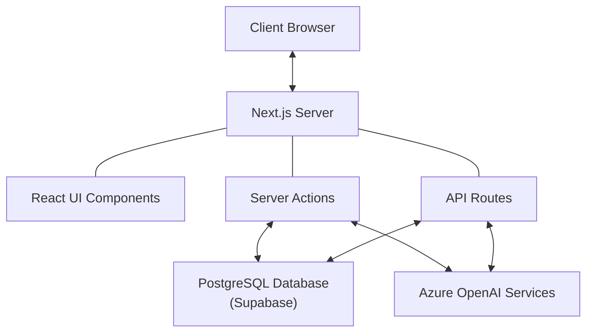
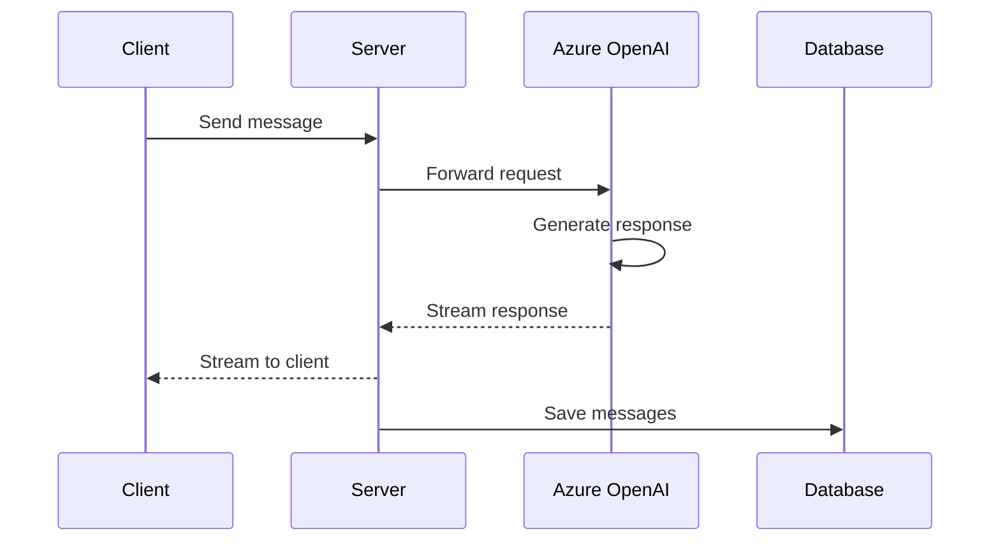
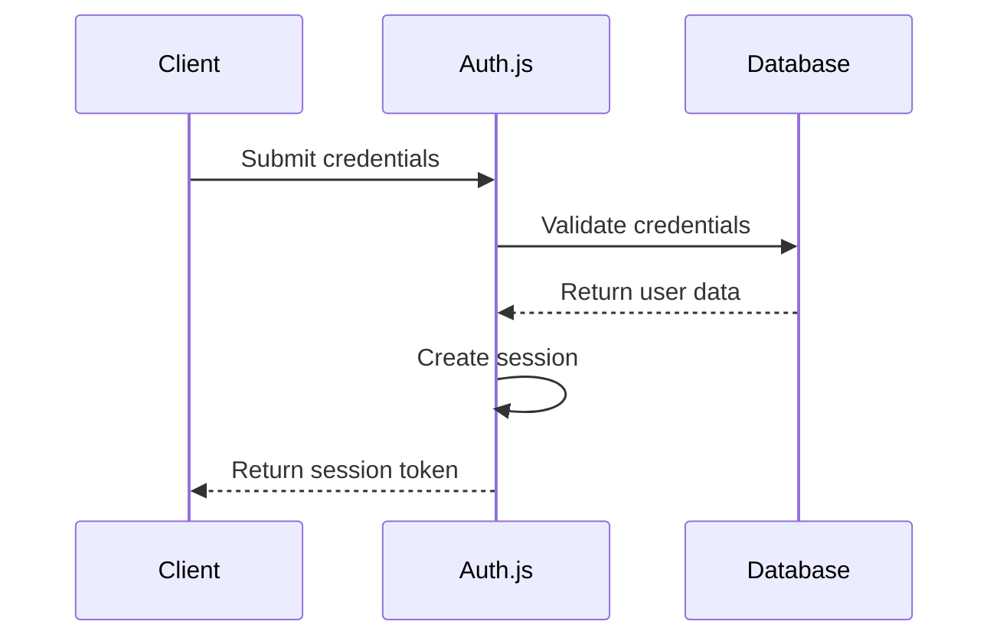
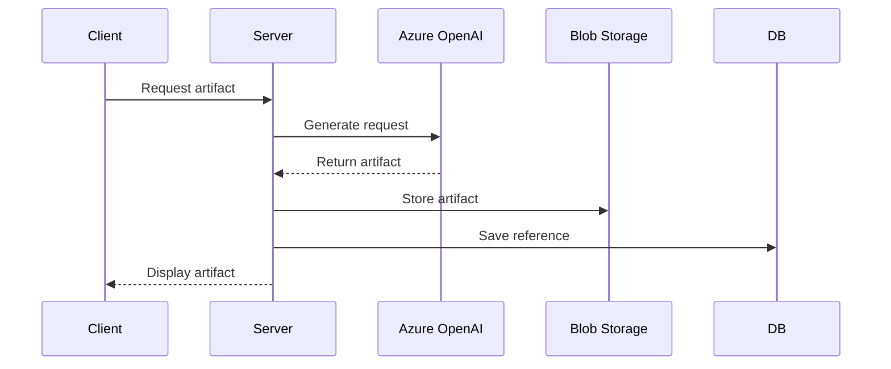
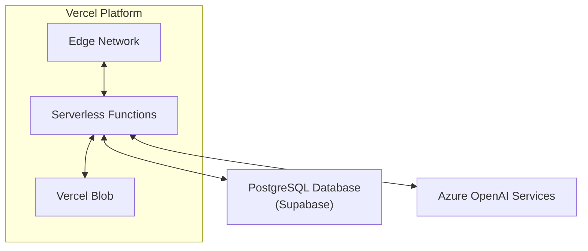

# Architecture Documentation

## System Overview

The AI Chatbot is built on a modern web architecture using Next.js with the App Router pattern. It leverages Azure OpenAI services for AI capabilities and PostgreSQL for data persistence. The application follows a component-based architecture with server-side rendering and client-side interactivity.



## Core Components

### 1. Frontend Architecture

The frontend is built with React and Next.js, utilizing the App Router pattern for routing and navigation.

#### Key Components:

- **Chat Interface**: Handles user input and displays AI responses
- **Model Selector**: Allows users to choose different AI models
- **Multimodal Input**: Supports text, file uploads, and other input types
- **Artifact Display**: Renders various types of AI-generated content

#### UI Framework:

- **Styling**: Tailwind CSS for utility-first styling
- **Components**: Radix UI primitives with shadcn/ui for accessible components
- **State Management**: React hooks and SWR for data fetching and caching

### 2. Backend Architecture

The backend is implemented using Next.js API routes and Server Actions.

#### Key Components:

- **API Routes**: Handle HTTP requests for chat, history, and other features
- **Server Actions**: Process form submissions and perform server-side operations
- **Authentication**: Auth.js for user authentication and session management
- **Database Access**: Drizzle ORM for type-safe database operations

### 3. AI Integration

The application integrates with Azure OpenAI services for various AI capabilities.

#### Key Components:

- **AI Provider**: Custom provider configuration for Azure OpenAI
- **Model Management**: Support for multiple model types and configurations
- **Streaming**: Real-time streaming of AI responses with smooth rendering
- **Tool Integration**: Framework for AI to use external tools (weather, document creation, etc.)

### 4. Database Architecture

The application uses PostgreSQL (via Supabase) for data persistence.

#### Key Components:

- **Schema**: Defined using Drizzle ORM with migrations
- **Tables**: Users, Chats, Messages, Artifacts, etc.
- **Migrations**: Automated schema updates and versioning
- **Queries**: Optimized database access patterns

## Data Flow

### 1. Chat Interaction Flow



### 2. Authentication Flow



### 3. Artifact Generation Flow



## Technology Stack

### Frontend
- **Framework**: Next.js 15+
- **UI Library**: React 19+
- **Styling**: Tailwind CSS
- **Data Fetching**: SWR
- **Components**: Radix UI / shadcn/ui

### Backend
- **Runtime**: Node.js
- **Framework**: Next.js App Router
- **Authentication**: Auth.js (NextAuth)
- **API**: REST endpoints

### Database
- **Primary Database**: PostgreSQL (Supabase)
- **ORM**: Drizzle ORM
- **File Storage**: Vercel Blob

### AI Services
- **Provider**: Azure OpenAI
- **Models**:
  - GPT-4o (chat)
  - GPT-4o Mini (reasoning)
  - DALL-E 3 (image generation)

### DevOps
- **Hosting**: Vercel
- **Environment**: Node.js
- **Package Manager**: pnpm

## Code Organization

The application follows a modular structure organized by feature and function:

```
/
├── app/                    # Next.js App Router
│   ├── (auth)/             # Authentication routes and components
│   ├── (chat)/             # Chat interface routes and API
│   │   ├── api/            # API routes for chat functionality
│   │   ├── chat/           # Chat UI pages
│   ├── (portfolio)/        # Portfolio section
├── components/             # Shared React components
│   ├── ui/                 # UI primitives and base components
├── lib/                    # Shared utilities and business logic
│   ├── ai/                 # AI integration and providers
│   │   ├── tools/          # Tool implementations for AI
│   ├── db/                 # Database schema and queries
│   │   ├── migrations/     # Database migrations
├── public/                 # Static assets
├── artifacts/              # Generated content storage
```

## Security Architecture

### Authentication
- JWT-based authentication using Auth.js
- Secure session management
- CSRF protection

### Data Protection
- Input validation and sanitization
- Parameterized queries to prevent SQL injection
- Content security policies

### API Security
- Rate limiting
- API key protection
- Request validation

## Scalability Considerations

### Performance Optimization
- Edge caching for static content
- Optimistic UI updates
- Incremental Static Regeneration where applicable

### Database Scaling
- Connection pooling
- Indexed queries
- Efficient schema design

### AI Service Scaling
- Request throttling
- Fallback mechanisms
- Caching of common responses

## Deployment Architecture

The application is designed to be deployed on Vercel's platform:



1. Static assets and UI components are served from the Edge Network
2. API routes and Server Actions run as Serverless Functions
3. Generated artifacts are stored in Vercel Blob
4. Database operations connect to PostgreSQL
5. AI requests are forwarded to Azure OpenAI

## Integration Points

### External Services
- Azure OpenAI API for AI capabilities
- Supabase for PostgreSQL database
- Vercel Blob for file storage

### Internal APIs
- Chat API for conversation management
- History API for retrieving past conversations
- Document API for artifact management
- Suggestions API for content recommendations
- Weather API for weather information

## Future Architecture Considerations

### Microservices Evolution
- Potential to split into specialized services
- Dedicated artifact generation service
- Separate authentication service

### Advanced Caching
- Redis integration for session and response caching
- CDN integration for static assets

### Real-time Features
- WebSocket integration for real-time collaboration
- Pub/Sub architecture for notifications
