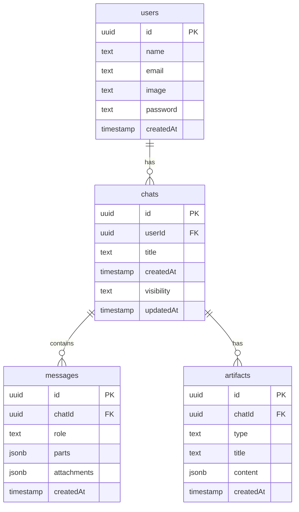

# Database Schema Documentation

This document provides a comprehensive overview of the database schema used in the AI Chatbot application. The application uses PostgreSQL with Drizzle ORM for database management.

## Overview

The database schema is designed to support the following core functionalities:

- User account management
- Chat history storage
- Message persistence
- Artifact management
- Visibility control for chats

## Schema Diagram



## Tables

### Users Table

Stores user account information.

| Column      | Type      | Description                           | Constraints        |
|-------------|-----------|---------------------------------------|-------------------|
| id          | uuid      | Unique identifier for the user        | Primary Key       |
| name        | text      | User's display name                   | Nullable          |
| email       | text      | User's email address                  | Unique, Not Null  |
| image       | text      | URL to user's profile image           | Nullable          |
| password    | text      | Hashed password                       | Nullable          |
| createdAt   | timestamp | When the user account was created     | Not Null, Default |

```sql
CREATE TABLE users (
  id UUID PRIMARY KEY DEFAULT gen_random_uuid(),
  name TEXT,
  email TEXT UNIQUE NOT NULL,
  image TEXT,
  password TEXT,
  created_at TIMESTAMP WITH TIME ZONE NOT NULL DEFAULT NOW()
);
```

### Chats Table

Stores chat sessions.

| Column      | Type      | Description                           | Constraints        |
|-------------|-----------|---------------------------------------|-------------------|
| id          | uuid      | Unique identifier for the chat        | Primary Key       |
| userId      | uuid      | Reference to the user who owns the chat | Foreign Key     |
| title       | text      | Title of the chat conversation        | Not Null          |
| createdAt   | timestamp | When the chat was created             | Not Null, Default |
| visibility  | text      | Privacy setting ('public' or 'private') | Not Null, Default |
| updatedAt   | timestamp | When the chat was last updated        | Not Null, Default |

```sql
CREATE TABLE chats (
  id UUID PRIMARY KEY DEFAULT gen_random_uuid(),
  user_id UUID NOT NULL REFERENCES users(id) ON DELETE CASCADE,
  title TEXT NOT NULL,
  created_at TIMESTAMP WITH TIME ZONE NOT NULL DEFAULT NOW(),
  visibility TEXT NOT NULL DEFAULT 'private',
  updated_at TIMESTAMP WITH TIME ZONE NOT NULL DEFAULT NOW()
);
```

### Messages Table

Stores individual messages within chats.

| Column      | Type      | Description                           | Constraints        |
|-------------|-----------|---------------------------------------|-------------------|
| id          | uuid      | Unique identifier for the message     | Primary Key       |
| chatId      | uuid      | Reference to the chat                 | Foreign Key       |
| role        | text      | Message role ('user' or 'assistant')  | Not Null          |
| parts       | jsonb     | Message content parts                 | Not Null          |
| attachments | jsonb     | Message attachments                   | Not Null, Default |
| createdAt   | timestamp | When the message was created          | Not Null, Default |

```sql
CREATE TABLE messages (
  id UUID PRIMARY KEY DEFAULT gen_random_uuid(),
  chat_id UUID NOT NULL REFERENCES chats(id) ON DELETE CASCADE,
  role TEXT NOT NULL,
  parts JSONB NOT NULL,
  attachments JSONB NOT NULL DEFAULT '[]',
  created_at TIMESTAMP WITH TIME ZONE NOT NULL DEFAULT NOW()
);
```

### Artifacts Table

Stores generated content artifacts.

| Column      | Type      | Description                           | Constraints        |
|-------------|-----------|---------------------------------------|-------------------|
| id          | uuid      | Unique identifier for the artifact    | Primary Key       |
| chatId      | uuid      | Reference to the chat                 | Foreign Key       |
| type        | text      | Type of artifact (image, code, etc.)  | Not Null          |
| title       | text      | Title of the artifact                 | Not Null          |
| content     | jsonb     | Artifact content                      | Not Null          |
| createdAt   | timestamp | When the artifact was created         | Not Null, Default |

```sql
CREATE TABLE artifacts (
  id UUID PRIMARY KEY DEFAULT gen_random_uuid(),
  chat_id UUID NOT NULL REFERENCES chats(id) ON DELETE CASCADE,
  type TEXT NOT NULL,
  title TEXT NOT NULL,
  content JSONB NOT NULL,
  created_at TIMESTAMP WITH TIME ZONE NOT NULL DEFAULT NOW()
);
```

## Drizzle ORM Schema

The application uses Drizzle ORM to define and interact with the database schema. Here's how the schema is defined:

```typescript
// lib/db/schema.ts
import { pgTable, uuid, text, timestamp, jsonb } from 'drizzle-orm/pg-core';

export const users = pgTable('users', {
  id: uuid('id').primaryKey().defaultRandom(),
  name: text('name'),
  email: text('email').notNull().unique(),
  image: text('image'),
  password: text('password'),
  createdAt: timestamp('created_at', { withTimezone: true }).notNull().defaultNow(),
});

export const chats = pgTable('chats', {
  id: uuid('id').primaryKey().defaultRandom(),
  userId: uuid('user_id')
    .notNull()
    .references(() => users.id, { onDelete: 'cascade' }),
  title: text('title').notNull(),
  createdAt: timestamp('created_at', { withTimezone: true }).notNull().defaultNow(),
  visibility: text('visibility').notNull().default('private'),
  updatedAt: timestamp('updated_at', { withTimezone: true }).notNull().defaultNow(),
});

export const messages = pgTable('messages', {
  id: uuid('id').primaryKey().defaultRandom(),
  chatId: uuid('chat_id')
    .notNull()
    .references(() => chats.id, { onDelete: 'cascade' }),
  role: text('role').notNull(),
  parts: jsonb('parts').notNull(),
  attachments: jsonb('attachments').notNull().default([]),
  createdAt: timestamp('created_at', { withTimezone: true }).notNull().defaultNow(),
});

export const artifacts = pgTable('artifacts', {
  id: uuid('id').primaryKey().defaultRandom(),
  chatId: uuid('chat_id')
    .notNull()
    .references(() => chats.id, { onDelete: 'cascade' }),
  type: text('type').notNull(),
  title: text('title').notNull(),
  content: jsonb('content').notNull(),
  createdAt: timestamp('created_at', { withTimezone: true }).notNull().defaultNow(),
});
```

## Relationships

### One-to-Many Relationships

- **User to Chats**: One user can have many chat sessions
  - `users.id` → `chats.userId`

- **Chat to Messages**: One chat can have many messages
  - `chats.id` → `messages.chatId`

- **Chat to Artifacts**: One chat can have many artifacts
  - `chats.id` → `artifacts.chatId`

## Indexes

The following indexes improve query performance:

```sql
-- Find chats by user ID
CREATE INDEX idx_chats_user_id ON chats(user_id);

-- Find messages by chat ID
CREATE INDEX idx_messages_chat_id ON messages(chat_id);

-- Find artifacts by chat ID
CREATE INDEX idx_artifacts_chat_id ON artifacts(chat_id);

-- Find chats by visibility
CREATE INDEX idx_chats_visibility ON chats(visibility);
```

## Common Queries

### Get User's Chats

```typescript
import { db } from '@/lib/db';
import { chats } from '@/lib/db/schema';
import { eq } from 'drizzle-orm';

const userChats = await db.select()
  .from(chats)
  .where(eq(chats.userId, userId))
  .orderBy(desc(chats.updatedAt));
```

### Get Chat Messages

```typescript
import { db } from '@/lib/db';
import { messages } from '@/lib/db/schema';
import { eq } from 'drizzle-orm';

const chatMessages = await db.select()
  .from(messages)
  .where(eq(messages.chatId, chatId))
  .orderBy(asc(messages.createdAt));
```

### Save New Message

```typescript
import { db } from '@/lib/db';
import { messages } from '@/lib/db/schema';

await db.insert(messages).values({
  id: messageId,
  chatId: chatId,
  role: 'user',
  parts: messageParts,
  attachments: messageAttachments,
  createdAt: new Date(),
});
```

## Migration System

The application uses Drizzle Kit for database migrations.

### Migration Commands

```bash
# Generate migration files based on schema changes
npm run db:generate

# Apply migrations to the database
npm run db:migrate

# View database schema in web UI
npm run db:studio
```

### Migration Process

1. Update schema definition in `lib/db/schema.ts`
2. Run `npm run db:generate` to create migration files
3. Review generated migration files in `lib/db/migrations/`
4. Run `npm run db:migrate` to apply migrations to the database

## Data Types

### JSONB Structure for Message Parts

```json
[
  {
    "type": "text",
    "content": "This is a text message"
  },
  {
    "type": "code",
    "language": "javascript",
    "content": "console.log('Hello world');"
  }
]
```

### JSONB Structure for Attachments

```json
[
  {
    "type": "image",
    "title": "Generated Image",
    "data": {
      "url": "https://example.com/image.png",
      "width": 512,
      "height": 512
    }
  }
]
```

### JSONB Structure for Artifact Content

```json
{
  "type": "document",
  "format": "markdown",
  "content": "# Document Title\n\nThis is a document created by the AI.",
  "metadata": {
    "author": "AI Assistant",
    "created": "2025-04-24T12:00:00Z"
  }
}
```

## Performance Considerations

### Optimizations

1. **Indexing**: Key columns are indexed for faster lookups
2. **JSON Storage**: Using JSONB for flexible data structures
3. **Cascade Deletes**: Automatic cleanup of related records
4. **Timestamp Defaults**: Automatic timestamp handling

### Query Patterns

1. **Pagination**: Limit results and use cursor-based pagination for large datasets
2. **Selective Columns**: Only select needed columns for better performance
3. **Eager Loading**: Load related data in a single query when possible

## Security Considerations

1. **Foreign Key Constraints**: Ensure data integrity
2. **User Ownership**: Always filter by user ID for authorization
3. **Input Validation**: Validate all data before insertion
4. **Parameterized Queries**: Use Drizzle ORM to prevent SQL injection

## Schema Evolution

As the application evolves, the database schema may need to change. Follow these guidelines:

1. **Additive Changes**: Prefer adding new columns/tables over modifying existing ones
2. **Nullable Columns**: Make new columns nullable or provide defaults
3. **Versioned Migrations**: Never modify existing migrations, create new ones
4. **Testing**: Test migrations on a copy of production data before deploying
