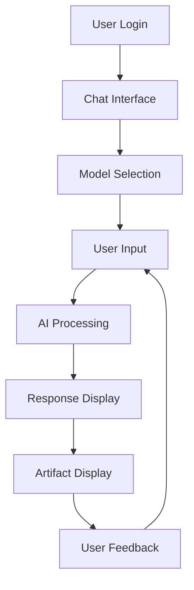
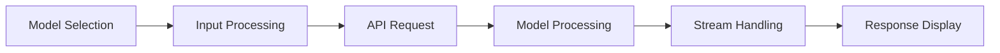
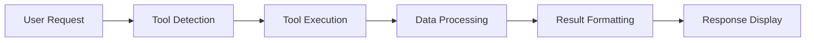

# Product Requirements Document

## 1. Project Overview

The AI Chatbot is a sophisticated multi-model conversational application built with Next.js and the Vercel AI SDK. It provides users with various AI-powered capabilities including text generation, reasoning, image creation, code generation, document creation, and specialized tools like weather information.

The application leverages Azure OpenAI models and integrates with a PostgreSQL database for persistent storage of chat history and user data. It features a modern, responsive UI built with React and Tailwind CSS.

## 2. User Personas

### Regular User
- Wants to have natural conversations with an AI
- Needs to generate content (text, images, code)
- Values privacy controls for their conversations
- Expects intuitive UI and responsive design

### Developer
- Needs to generate and debug code
- Wants to understand AI reasoning processes
- Requires technical documentation generation
- Values tool integration capabilities

### Content Creator
- Needs to create and edit documents
- Wants to generate images for content
- Requires suggestions for content improvement
- Values multi-modal input and output capabilities

## 3. Features and Requirements

### 3.1 Core Chat Functionality
- Real-time conversation with AI models
- Persistent chat history
- Chat title generation
- Ability to delete conversations
- Privacy controls (public/private chats)

### 3.2 AI Model Integration
- Multiple model support:
  - Regular chat model (`chat-model`) - Text generation with tool access
  - Reasoning model (`chat-model-reasoning`) - Explicit reasoning capabilities
  - Title model (`title-model`) - Optimized for generating chat titles
  - Artifact model (`artifact-model`) - For generating various content types
  - Image model (`small-model`) - For image generation

### 3.3 Authentication System
- User registration and login
- Session management
- Access control for private chats

### 3.4 Database Integration
- PostgreSQL database for storing:
  - User information
  - Chat history
  - Generated artifacts
  - User preferences

### 3.5 Content Generation
- Text generation with various styles and tones
- Code generation with syntax highlighting
- Document creation and editing
- Image generation capabilities

### 3.6 Tool Integration
- Weather information tool
- Document creation and update tools
- Content suggestion tools

## 4. Functional Flow

### 4.1 Chat Interaction Flow

### 4.2 Model Selection and Processing Flow

### 4.3 Tool Integration Flow

## 5. User Experience Flow

### 5.1 Chat Experience

1. **Initial Interaction**
   - User logs in to the application
   - User is presented with chat history or option to start a new chat
   - User can select visibility (public/private) for the chat

2. **Model Selection**
   - User can select from available models:
     - Regular chat model (default)
     - Reasoning model (shows thinking process)
     - Other specialized models

3. **Conversation Flow**
   - User enters text or uploads files
   - AI processes the input based on selected model
   - Response is streamed in real-time with smooth word-by-word display
   - For reasoning model, the thinking process is visible

4. **Content Generation**
   - User can request various content types:
     - Text responses (default)
     - Code with syntax highlighting
     - Images through prompts
     - Documents with formatting

5. **Tool Usage**
   - Weather information: User can ask about weather and receive visual cards
   - Document creation: AI can create structured documents
   - Content suggestions: AI can provide content improvement ideas

6. **Feedback Loop**
   - User can continue the conversation based on AI response
   - User can provide feedback on responses
   - Chat history is saved automatically

### 5.2 Multi-modal Experience

1. **Text Input/Output**
   - Primary interaction method
   - Supports markdown formatting
   - Code syntax highlighting

2. **Image Generation**
   - User provides text description
   - AI generates relevant images
   - Images are displayed inline in the chat

3. **Code Generation**
   - User describes coding requirements
   - AI generates code with proper formatting
   - Syntax highlighting enhances readability

4. **Document Creation**
   - User requests document creation
   - AI generates structured documents
   - Documents can be viewed and edited

5. **Weather Information**
   - User asks about weather for a location
   - AI retrieves weather data
   - Information is displayed in a visual card format

## 6. Technical Requirements

### 6.1 Frontend
- Next.js 15+ with App Router
- React 19+ for UI components
- Tailwind CSS for styling
- SWR for data fetching and caching
- Responsive design for all device sizes

### 6.2 Backend
- Next.js API routes
- Server Actions for backend operations
- Authentication with Auth.js
- Database integration with Drizzle ORM
- File storage with Vercel Blob

### 6.3 AI Integration
- Azure OpenAI API integration
- Multiple model support
- Streaming response handling
- Tool calling capabilities

### 6.4 Database
- PostgreSQL database
- Schema management with Drizzle ORM
- Migration system for schema changes

## 7. Non-functional Requirements

### 7.1 Performance
- Response time < 2 seconds for initial response
- Smooth streaming of AI responses
- Optimistic UI updates for better user experience

### 7.2 Security
- Secure authentication
- Data encryption
- API key protection
- Input validation

### 7.3 Scalability
- Support for multiple concurrent users
- Efficient database queries
- Optimized API requests

### 7.4 Accessibility
- WCAG 2.1 AA compliance
- Keyboard navigation
- Screen reader support
- Color contrast requirements

## 8. Future Enhancements

### 8.1 Additional Models
- Support for more specialized AI models
- Fine-tuning capabilities for specific use cases

### 8.2 Enhanced Tools
- More integrated tools and data sources
- Custom tool creation interface

### 8.3 Collaboration Features
- Shared chats between multiple users
- Collaborative document editing
- Team spaces

### 8.4 Advanced Analytics
- Usage statistics and insights
- Performance metrics
- User behavior analysis

### 8.5 Mobile Applications
- Native mobile apps for iOS and Android
- Offline capabilities
