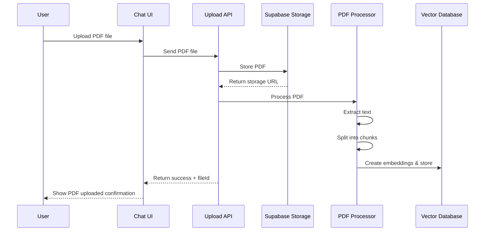
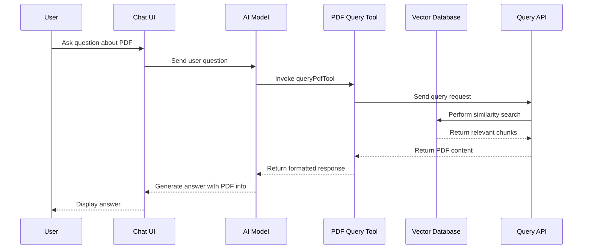
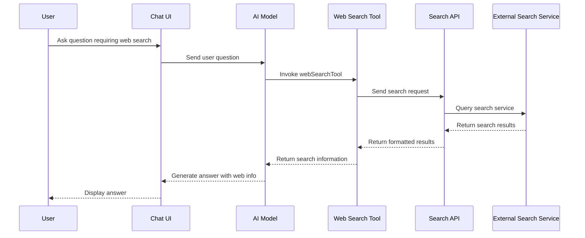
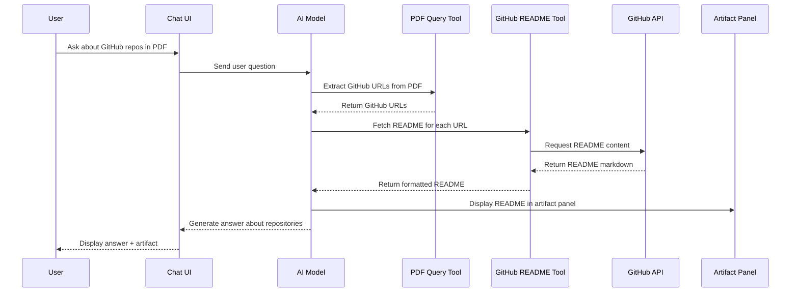

# PDF Processing and Web Search Implementation Guide

This guide provides a comprehensive walkthrough for implementing PDF processing and web search functionality in your existing chat application. This implementation will allow users to:

1. Upload PDF files to Supabase storage
2. Process and extract information from PDFs
3. Answer questions related to the PDF content
4. Search the web for additional information
5. Extract GitHub README files based on URLs found in PDFs

## Table of Contents

1. [Setting Up Supabase Storage for PDFs](#1-setting-up-supabase-storage-for-pdfs)
2. [Implementing PDF Processing](#2-implementing-pdf-processing)
3. [Creating AI Tools for PDF and Web Search](#3-creating-ai-tools-for-pdf-and-web-search)
4. [Updating the UI Components](#4-updating-the-ui-components)
5. [Implementing the API Routes](#5-implementing-the-api-routes)
6. [Integration and Workflow](#6-integration-and-workflow)
7. [Testing the Implementation](#7-testing-the-implementation)

## 1. Setting Up Supabase Storage for PDFs

### 1.1 Install Supabase Client

```bash
npm install @supabase/supabase-js
```

### 1.2 Configure Supabase Client

Create a new file at `lib/supabase.ts`:

```typescript
import { createClient } from '@supabase/supabase-js';

const supabaseUrl = process.env.NEXT_PUBLIC_SUPABASE_URL || '';
const supabaseAnonKey = process.env.NEXT_PUBLIC_SUPABASE_ANON_KEY || '';

export const supabase = createClient(supabaseUrl, supabaseAnonKey);
```

### 1.3 Update Environment Variables

Add the following to your `.env.local` file:

```
NEXT_PUBLIC_SUPABASE_URL=your_supabase_url
NEXT_PUBLIC_SUPABASE_ANON_KEY=your_supabase_anon_key
```

### 1.4 Create a Storage Bucket for PDFs

In your Supabase dashboard:
1. Go to Storage
2. Create a new bucket named "pdfs"
3. Set the bucket's privacy settings to "Authenticated users only" or "Public" based on your requirements

## 2. Implementing PDF Processing

### 2.1 Install PDF Processing Libraries

```bash
npm install pdf-parse langchain @langchain/openai
```

### 2.2 Create a PDF Processor Utility

Create a new file at `lib/pdf-processor.ts`:

```typescript
import { PDFLoader } from "langchain/document_loaders/fs/pdf";
import { RecursiveCharacterTextSplitter } from "langchain/text_splitter";
import { OpenAIEmbeddings } from "@langchain/openai";
import { MemoryVectorStore } from "langchain/vectorstores/memory";

// Map to store PDF vector stores by file ID
const pdfVectorStores = new Map<string, MemoryVectorStore>();

export async function processPdfBuffer(buffer: Buffer, fileId: string): Promise<string> {
  try {
    // Create a Blob from the buffer
    const blob = new Blob([buffer]);
    
    // Load PDF
    const loader = new PDFLoader(blob);
    const docs = await loader.load();
    
    // Get the raw text
    const rawText = docs.map(doc => doc.pageContent).join("\n");
    
    // Split text into chunks
    const textSplitter = new RecursiveCharacterTextSplitter({
      chunkSize: 1000,
      chunkOverlap: 200,
    });
    const splitDocs = await textSplitter.splitDocuments(docs);
    
    // Create vector store with embeddings
    const vectorStore = await MemoryVectorStore.fromDocuments(
      splitDocs,
      new OpenAIEmbeddings({
        openAIApiKey: process.env.OPENAI_API_KEY,
      })
    );
    
    // Store the vector store for later retrieval
    pdfVectorStores.set(fileId, vectorStore);
    
    return rawText;
  } catch (error) {
    console.error("Error processing PDF:", error);
    throw new Error("Failed to process PDF");
  }
}

export async function queryPdf(fileId: string, query: string): Promise<string | null> {
  try {
    const vectorStore = pdfVectorStores.get(fileId);
    
    if (!vectorStore) {
      throw new Error("PDF not found or not processed");
    }
    
    // Perform similarity search
    const results = await vectorStore.similaritySearch(query, 5);
    
    if (results.length === 0) {
      return "No relevant information found in the PDF.";
    }
    
    // Return the relevant content
    return results.map(doc => doc.pageContent).join("\n\n");
  } catch (error) {
    console.error("Error querying PDF:", error);
    return null;
  }
}
```

## 3. Creating AI Tools for PDF and Web Search

### 3.1 Create a PDF Query Tool

Create a new file at `lib/ai/tools/query-pdf.ts`:

```typescript
import { tool } from 'ai';
import { z } from 'zod';
import { queryPdf } from '@/lib/pdf-processor';

export const queryPdfTool = tool({
  description: 'Query information from a previously uploaded PDF document',
  parameters: z.object({
    fileId: z.string().describe('The ID of the uploaded PDF file'),
    query: z.string().describe('The question or query about the PDF content'),
  }),
  execute: async ({ fileId, query }) => {
    try {
      const result = await queryPdf(fileId, query);
      
      if (!result) {
        return {
          success: false,
          message: 'Failed to query the PDF or no relevant information found',
        };
      }
      
      return {
        success: true,
        content: result,
      };
    } catch (error) {
      console.error('Error querying PDF:', error);
      return {
        success: false,
        message: 'An error occurred while querying the PDF',
      };
    }
  },
});
```

### 3.2 Create a Web Search Tool

Create a new file at `lib/ai/tools/web-search.ts`:

```typescript
import { tool } from 'ai';
import { z } from 'zod';

export const webSearchTool = tool({
  description: 'Search the web for information',
  parameters: z.object({
    query: z.string().describe('The search query'),
  }),
  execute: async ({ query }) => {
    try {
      // Using Serper.dev API for web search (you can use any search API)
      const response = await fetch('https://api.serper.dev/search', {
        method: 'POST',
        headers: {
          'X-API-KEY': process.env.SERPER_API_KEY || '',
          'Content-Type': 'application/json',
        },
        body: JSON.stringify({
          q: query,
          num: 5,
        }),
      });

      if (!response.ok) {
        throw new Error(`Search API returned ${response.status}`);
      }

      const data = await response.json();
      
      // Format the search results
      const organicResults = data.organic || [];
      const formattedResults = organicResults.map((result: any) => ({
        title: result.title,
        link: result.link,
        snippet: result.snippet,
      }));

      return {
        success: true,
        results: formattedResults,
      };
    } catch (error) {
      console.error('Error searching the web:', error);
      return {
        success: false,
        message: 'An error occurred while searching the web',
      };
    }
  },
});
```

### 3.3 Create a GitHub README Fetcher Tool

Create a new file at `lib/ai/tools/fetch-github-readme.ts`:

```typescript
import { tool } from 'ai';
import { z } from 'zod';

export const fetchGithubReadmeTool = tool({
  description: 'Fetch README content from a GitHub repository',
  parameters: z.object({
    repoUrl: z.string().describe('The GitHub repository URL'),
  }),
  execute: async ({ repoUrl }) => {
    try {
      // Extract owner and repo from URL
      const urlPattern = /github\.com\/([^\/]+)\/([^\/]+)/;
      const match = repoUrl.match(urlPattern);
      
      if (!match) {
        return {
          success: false,
          message: 'Invalid GitHub repository URL',
        };
      }
      
      const [, owner, repo] = match;
      
      // Fetch README content using GitHub API
      const response = await fetch(`https://api.github.com/repos/${owner}/${repo}/readme`, {
        headers: {
          'Accept': 'application/vnd.github.v3.raw',
          'Authorization': process.env.GITHUB_TOKEN ? `token ${process.env.GITHUB_TOKEN}` : '',
        },
      });
      
      if (!response.ok) {
        throw new Error(`GitHub API returned ${response.status}`);
      }
      
      const readmeContent = await response.text();
      
      return {
        success: true,
        content: readmeContent,
        repoInfo: {
          owner,
          repo,
          url: repoUrl,
        },
      };
    } catch (error) {
      console.error('Error fetching GitHub README:', error);
      return {
        success: false,
        message: 'An error occurred while fetching the GitHub README',
      };
    }
  },
});
```

### 3.4 Update Tools Index

Create or update the file at `lib/ai/tools/index.ts`:

```typescript
export * from './create-document';
export * from './update-document';
export * from './get-weather';
export * from './request-suggestions';
export * from './query-pdf';
export * from './web-search';
export * from './fetch-github-readme';
```

## 4. Updating the UI Components

### 4.1 Update File Upload Component

Modify the `MultimodalInput` component to accept PDF files:

```typescript
// In components/multimodal-input.tsx

// Update the file input to accept PDFs
<input
  type="file"
  className="fixed -top-4 -left-4 size-0.5 opacity-0 pointer-events-none"
  ref={fileInputRef}
  multiple
  accept="image/jpeg,image/png,application/pdf" // Add PDF MIME type
  onChange={handleFileChange}
  tabIndex={-1}
/>
```

### 4.2 Update File Upload API

Modify the file upload API to accept PDF files:

```typescript
// In app/(chat)/api/files/upload/route.ts

// Update the FileSchema to accept PDF files
const FileSchema = z.object({
  file: z
    .instanceof(Blob)
    .refine((file) => file.size <= 10 * 1024 * 1024, {
      message: 'File size should be less than 10MB',
    })
    .refine((file) => ['image/jpeg', 'image/png', 'application/pdf'].includes(file.type), {
      message: 'File type should be JPEG, PNG, or PDF',
    }),
});
```

### 4.3 Create a PDF Artifact Component

Create a new file at `artifacts/pdf/client.tsx`:

```tsx
import { ArtifactDefinition } from '@/components/artifact';

export const pdfArtifact: ArtifactDefinition = {
  kind: 'pdf',
  name: 'PDF',
  icon: (
    <svg
      xmlns="http://www.w3.org/2000/svg"
      width="24"
      height="24"
      viewBox="0 0 24 24"
      fill="none"
      stroke="currentColor"
      strokeWidth="2"
      strokeLinecap="round"
      strokeLinejoin="round"
    >
      <path d="M14.5 2H6a2 2 0 0 0-2 2v16a2 2 0 0 0 2 2h12a2 2 0 0 0 2-2V7.5L14.5 2z" />
      <polyline points="14 2 14 8 20 8" />
      <path d="M9 13v-1h6v1" />
      <path d="M11 18h2" />
      <path d="M12 12v6" />
    </svg>
  ),
  render: ({ content, documentId }) => {
    return (
      <div className="flex flex-col w-full h-full overflow-hidden">
        <iframe
          src={content}
          className="w-full h-full border-0"
          title={`PDF Document ${documentId}`}
        />
      </div>
    );
  },
};
```

### 4.4 Update Artifact Definitions

Update the artifact definitions in `components/artifact.tsx`:

```tsx
// In components/artifact.tsx
import { pdfArtifact } from '@/artifacts/pdf/client';

export const artifactDefinitions = [
  textArtifact,
  codeArtifact,
  imageArtifact,
  sheetArtifact,
  pdfArtifact, // Add PDF artifact
];
```

## 5. Implementing the API Routes

### 5.1 Create a PDF Upload and Processing API

Create a new file at `app/(chat)/api/pdf/process/route.ts`:

```typescript
import { NextResponse } from 'next/server';
import { supabase } from '@/lib/supabase';
import { auth } from '@/app/(auth)/auth';
import { processPdfBuffer } from '@/lib/pdf-processor';
import { v4 as uuidv4 } from 'uuid';

export async function POST(request: Request) {
  const session = await auth();

  if (!session) {
    return NextResponse.json({ error: 'Unauthorized' }, { status: 401 });
  }

  try {
    const formData = await request.formData();
    const file = formData.get('file') as File;

    if (!file || file.type !== 'application/pdf') {
      return NextResponse.json({ error: 'Invalid PDF file' }, { status: 400 });
    }

    // Generate a unique file ID
    const fileId = uuidv4();
    const fileName = `${fileId}-${file.name}`;
    
    // Upload to Supabase Storage
    const buffer = Buffer.from(await file.arrayBuffer());
    const { data: uploadData, error: uploadError } = await supabase.storage
      .from('pdfs')
      .upload(fileName, buffer, {
        contentType: 'application/pdf',
        cacheControl: '3600',
      });

    if (uploadError) {
      console.error('Supabase upload error:', uploadError);
      return NextResponse.json({ error: 'Failed to upload PDF' }, { status: 500 });
    }

    // Get public URL
    const { data: publicUrlData } = supabase.storage
      .from('pdfs')
      .getPublicUrl(fileName);

    // Process the PDF
    const pdfText = await processPdfBuffer(buffer, fileId);

    return NextResponse.json({
      success: true,
      fileId,
      fileName,
      url: publicUrlData.publicUrl,
      textPreview: pdfText.substring(0, 500) + (pdfText.length > 500 ? '...' : ''),
    });
  } catch (error) {
    console.error('Error processing PDF:', error);
    return NextResponse.json(
      { error: 'Failed to process PDF' },
      { status: 500 },
    );
  }
}
```

### 5.2 Create a PDF Query API

Create a new file at `app/(chat)/api/pdf/query/route.ts`:

```typescript
import { NextResponse } from 'next/server';
import { auth } from '@/app/(auth)/auth';
import { queryPdf } from '@/lib/pdf-processor';

export async function POST(request: Request) {
  const session = await auth();

  if (!session) {
    return NextResponse.json({ error: 'Unauthorized' }, { status: 401 });
  }

  try {
    const { fileId, query } = await request.json();

    if (!fileId || !query) {
      return NextResponse.json({ error: 'Missing fileId or query' }, { status: 400 });
    }

    const result = await queryPdf(fileId, query);

    if (!result) {
      return NextResponse.json(
        { error: 'Failed to query PDF or no relevant information found' },
        { status: 404 },
      );
    }

    return NextResponse.json({
      success: true,
      content: result,
    });
  } catch (error) {
    console.error('Error querying PDF:', error);
    return NextResponse.json(
      { error: 'Failed to query PDF' },
      { status: 500 },
    );
  }
}
```

### 5.3 Create a Web Search API

Create a new file at `app/(chat)/api/web-search/route.ts`:

```typescript
import { NextResponse } from 'next/server';
import { auth } from '@/app/(auth)/auth';

export async function POST(request: Request) {
  const session = await auth();

  if (!session) {
    return NextResponse.json({ error: 'Unauthorized' }, { status: 401 });
  }

  try {
    const { query } = await request.json();

    if (!query) {
      return NextResponse.json({ error: 'Missing query' }, { status: 400 });
    }

    // Using Serper.dev API for web search
    const response = await fetch('https://api.serper.dev/search', {
      method: 'POST',
      headers: {
        'X-API-KEY': process.env.SERPER_API_KEY || '',
        'Content-Type': 'application/json',
      },
      body: JSON.stringify({
        q: query,
        num: 5,
      }),
    });

    if (!response.ok) {
      throw new Error(`Search API returned ${response.status}`);
    }

    const data = await response.json();
    
    return NextResponse.json({
      success: true,
      results: data,
    });
  } catch (error) {
    console.error('Error searching the web:', error);
    return NextResponse.json(
      { error: 'Failed to search the web' },
      { status: 500 },
    );
  }
}
```

### 5.4 Create a GitHub README Fetcher API

Create a new file at `app/(chat)/api/github/readme/route.ts`:

```typescript
import { NextResponse } from 'next/server';
import { auth } from '@/app/(auth)/auth';

export async function POST(request: Request) {
  const session = await auth();

  if (!session) {
    return NextResponse.json({ error: 'Unauthorized' }, { status: 401 });
  }

  try {
    const { repoUrl } = await request.json();

    if (!repoUrl) {
      return NextResponse.json({ error: 'Missing repository URL' }, { status: 400 });
    }

    // Extract owner and repo from URL
    const urlPattern = /github\.com\/([^\/]+)\/([^\/]+)/;
    const match = repoUrl.match(urlPattern);
    
    if (!match) {
      return NextResponse.json({ error: 'Invalid GitHub repository URL' }, { status: 400 });
    }
    
    const [, owner, repo] = match;
    
    // Fetch README content using GitHub API
    const response = await fetch(`https://api.github.com/repos/${owner}/${repo}/readme`, {
      headers: {
        'Accept': 'application/vnd.github.v3.raw',
        'Authorization': process.env.GITHUB_TOKEN ? `token ${process.env.GITHUB_TOKEN}` : '',
      },
    });
    
    if (!response.ok) {
      return NextResponse.json(
        { error: `GitHub API returned ${response.status}` },
        { status: response.status },
      );
    }
    
    const readmeContent = await response.text();
    
    return NextResponse.json({
      success: true,
      content: readmeContent,
      repoInfo: {
        owner,
        repo,
        url: repoUrl,
      },
    });
  } catch (error) {
    console.error('Error fetching GitHub README:', error);
    return NextResponse.json(
      { error: 'Failed to fetch GitHub README' },
      { status: 500 },
    );
  }
}
```

## 6. Integration and Workflow

### 6.1 Workflow Diagrams

#### PDF Upload and Processing Workflow



#### PDF Query Workflow



#### Web Search Workflow



#### GitHub README Extraction Workflow



### 6.2 Update the AI Configuration

Update your AI configuration to include the new tools:

```typescript
// In app/(chat)/api/chat/route.ts or wherever your AI configuration is set up

import { 
  queryPdfTool, 
  webSearchTool, 
  fetchGithubReadmeTool 
} from '@/lib/ai/tools';

// Add the new tools to your existing AI configuration
const tools = [
  // ... your existing tools
  queryPdfTool,
  webSearchTool,
  fetchGithubReadmeTool,
];

// Configure your AI with the tools
const ai = new OpenAI({
  apiKey: process.env.OPENAI_API_KEY,
}).chat({
  tools,
  // ... other configuration
});
```

### 6.3 Update Environment Variables

Add the following to your `.env.local` file:

```
OPENAI_API_KEY=your_openai_api_key
SERPER_API_KEY=your_serper_api_key
GITHUB_TOKEN=your_github_token
```

## 7. Testing the Implementation

### 7.1 Test PDF Upload and Processing

1. Upload a PDF file through the chat interface
2. Verify that the PDF is uploaded to Supabase storage
3. Verify that the PDF is processed and indexed

### 7.2 Test PDF Querying

1. Ask a question related to the uploaded PDF
2. Verify that the AI responds with information from the PDF

### 7.3 Test Web Search

1. Ask a question that requires web search
2. Verify that the AI searches the web and returns relevant information

### 7.4 Test GitHub README Fetching

1. Upload a PDF containing GitHub URLs
2. Ask about GitHub repositories mentioned in the PDF
3. Verify that the AI extracts the URLs, fetches the README files, and displays them in the artifacts panel

## Example Workflow

Here's an example of how the entire workflow would function:

1. User uploads a PDF document containing information about various GitHub repositories
2. The PDF is uploaded to Supabase storage and processed by the PDF processor
3. User asks: "What GitHub repositories are mentioned in the PDF?"
4. The AI uses the `queryPdfTool` to extract GitHub URLs from the PDF
5. The AI uses the `fetchGithubReadmeTool` to fetch README files for each repository
6. The AI displays the README content in the artifacts panel
7. User asks: "Can you find more information about React on the web?"
8. The AI uses the `webSearchTool` to search for React information
9. The AI combines information from the PDF and web search to provide a comprehensive response

## Conclusion

This implementation guide provides a comprehensive approach to adding PDF processing and web search capabilities to your chat application. By following these steps, you'll be able to enhance your application with powerful document processing and information retrieval features.

Remember to handle errors gracefully and provide appropriate feedback to users throughout the process. Additionally, consider implementing caching mechanisms for web search results and GitHub README content to improve performance and reduce API calls.
